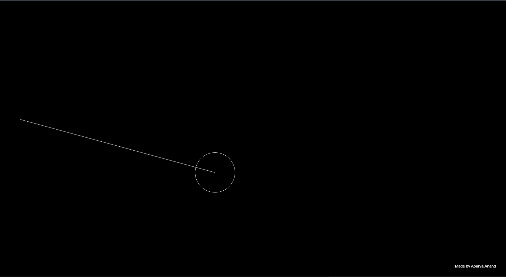

# when the ball returns.

---

## ✨ About the Project

This project is a minimalistic visual experiment where a small ball moves randomly across the screen, leaving behind a trail of its journey. It continues wandering until it eventually returns to the point where it originally began.

Within the limited space of the screen, the probability of returning to the exact starting point is surprisingly low. This simple behaviour symbolizes how difficult it can be in life to find our way back to where we truly belong.

The unpredictable path of the ball reflects the roller-coaster nature of life — full of randomness, turns, and unexpected directions.

---

## 🧠 The Idea Behind It

Every movement of the ball represents a decision or a moment in life.

Sometimes it goes far away.  
Sometimes it circles around.  
Sometimes it almost returns.

But eventually, after countless random paths, it finds its way back to the beginning.

> The point isn't the destination.  
> The point is the journey.

---

## 👀 A Small Thought

If you see this simply as an animation, you are a **developer**.

But if you pause and reflect on the meaning behind its journey, you are a **thinker**.

And thinkers are the ones who shape new ideas.

---

## Steps to make it your browser wallpaper (Chrome) - 

- Download the zip file of the project.
- Unzip it.
- Go to your chrome extension.
- Enable Developer Mode is disabled.
- Click on upload unpacked.
- Select the unzipped folder.
- Done!

## Made by Apurva Anand.
Feel free to contribute to this project.